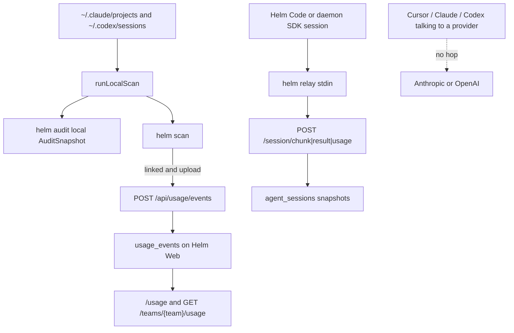

# About the next slice after the 2026-08-17 product bar

> Historical audit. Its recommended team-rollup slice and the live `proxy` / `wrap`
> intercept have since shipped. Use `docs/NORTH_STAR.md` and current source for
> product decisions; the claims below describe the repository at `e61ba25`.

This is an explanation of what Helm can already see, what the 2026-08-17 product bar still needs, and the one next slice that makes an org spend sentence true without inventing savings. It is not a how-to and not an implementation PR.

Checked on 2026-08-17 against helmai-dev/cli `main` at `e61ba25` (after PRs #2, #1, #3, #4). helmai-dev/web, helmai-dev/desktop, and helmai-dev/helm were read through the GitHub API. Those repos were not cloned.

The product bar, from the cofounder on 2026-08-17, is the target. Helm sits between apps and model providers so an engineering org can see the AI requests it is making. Then it finds waste and prices a cut. "This workload is costing you $30k/month and we think we can get it to $12k without materially affecting the output." OpenRouter can sit underneath as access and routing. Helm asks whether the request should exist, in this shape, at this cost.

That sentence is not true today. This note says what is true, what is missing, and what to build next. Identified-savings fields stay null. No 14% default. No invented $30k to $12k on the landing or in CLI output.

## Overview

Helm can price Claude Code and Codex transcripts on one machine. After `helm connect`, `helm scan` uploads day-level rows to Helm Web. `/usage` rolls those rows up for a team. `helm audit` reprints the local number, adds realized provider-cache savings, and leaves every identified-savings key null.

The CLI does not sit on the customer's path to Anthropic or OpenAI. Hidden `helm relay` publishes Helm-harness session chunks. The daemon runs work packages Helm Web queued. `code-bridge` is a token-blind team-plane for Helm Code. None of those forward chat completions.

The Pulse note's Phase A would print `byModel` and `byProject` on `helm audit`. That data is already on `ScanSummary`. `helm scan` already prints it. `--json` audit already contains it. Printing it again does not make "across the whole engineering org" true, and it does not fill a savings field.

The smallest honest next slice is a GET of the team rollup Helm Web already stores. `helm audit --team` prints observed org dollars from machines that already scanned. Identified savings stay null. That is the $30k half of the buyer sentence. The $12k half waits for a detector that does not exist.

## Key concepts

**Observed spend.** API-equivalent dollars from local transcripts or from the team usage ledger. Real product output.

**Identified savings.** A computed cut from a named waste type. Not computed. The keys exist so the document can say so.

**Realized provider-cache savings.** The 0.1× cache-read discount from `modelRates`. Money the provider already did not charge. Not a "you could cache more" finding.

**Unshared-replay ceiling.** `--users` times this machine's bill minus one. A what-if. Not measured org waste.

**Team rollup.** `TeamUsageRollup::build` on Helm Web. Cost, tokens, and breakdowns for one `team_id` over a day window. Only rows that were uploaded.

**Live model-request path.** HTTP from a coding tool to a model provider. Absent in this CLI. Do not invent one.

## Data shape

Name the document before any new flag.

Local audit already has this shape in `src/lib/audit-snapshot.ts`.

```
AuditSnapshot {
  kind: "helm.audit.v1"
  window_days: number
  source: "local_transcripts"
  illustrative: false
  observed: ScanSummary
  derived: { cache_read_share, provider_cache_savings_usd }
  inputs: { source, team_count, team_users }
  scenario: UnsharedReplayScenario | null
  not_computed: {
    identified_savings_usd: null
    waste_rate: null
    duplicate_prompt_count: null
    model_routing_opportunity_usd: null
    prompt_optimization_savings_usd: null
    shared_context_savings_usd: null
  }
}

ScanSummary {
  files, lines, events, totalCostUsd
  totals: { input, output, cacheWrite, cacheRead, sessions }
  byProject: { project, costUsd, sessions }[]
  byModel: { model, costUsd, calls }[]
}

UsageEventRow {
  provider: "claude" | "codex"
  model, project_hint, project_id, day
  sessions, calls
  input_tokens, output_tokens, cache_write_tokens, cache_read_tokens
  cost_usd
}
```

The next slice adds a sibling, not a new savings key. Field names copy the PHP rollup. Do not rename `cost_usd` to `totalCostUsd` in the JSON.

```
AuditSnapshot.source = "local_transcripts" | "team_rollup"

TeamRollupObserved {
  days, since
  totals: {
    cost_usd, sessions, calls
    input_tokens, output_tokens, cache_write_tokens, cache_read_tokens
    total_tokens, cache_read_share
  }
  by_day, by_user, by_project, by_provider, by_model
}
```

`not_computed` stays all null on both sources.

## What we can already see

### Which apps

`runLocalScan` walks Claude Code and Codex trees only (`src/lib/local-scan.ts`). Provider strings on the upload path are `claude` and `codex` (`UsageEventsController` validation on helmai-dev/web).

`helm hooks install` writes integrations for Claude Code, Codex, Cursor, OpenCode, Gemini CLI, Copilot CLI, Pi, Amp, and Kilo (`src/commands/hooks.ts` `getAgentHookStatus`). Session-end hooks on several of those agents spawn `helm scan --days 2 --quiet` (`src/lib/claude-settings.ts` `HELM_USAGE_SYNC_HOOK_COMMAND`, plus Codex, Pi, OpenCode, Kilo, Copilot, Amp). That scan still only reads the Claude and Codex trees. Cursor, Gemini, and Copilot spend never enter `UsageEventRow`.

Helm Desktop (`appId` `ai.tryhelm.desktop` in helmai-dev/desktop `electron-builder.yml`) does not scan transcripts itself. First-run onboarding runs `helm scan --json --days 30` (`src/main/helmCli.ts` `runFirstScan`).

Helm Code lives under `t3/` in desktop. `t3/scripts/build-desktop-artifact.ts` sets `DESKTOP_APP_ID` to `ai.tryhelm.code`. Code has its own local scanner at `t3/apps/server/src/usage/UsageService.ts`. It prices the same JSONL trees with LiteLLM rates. Transcripts stay on the machine. Code does not upload to helm-web. Do not port that scanner into this repo (`docs/spend-audit-plan/overview.md`).

helmai-dev/helm is a May 2026 context-injection product (`PRODUCT_DOCUMENTATION.md`, dated 2026-05-22). Its live API is `/api/v1` inject, capture, sync, and GitHub webhooks. It is not the spend ledger and not a model gateway.

### Which requests

Scan prices usage cells. Aggregates only. No transcript content is retained or uploaded (`src/lib/claude-scan.ts` file comment). Assistant lines are deduped by message id so streamed JSONL repeats do not double-count. That is not semantic prompt dedup.

Each cell has model, project hint, day, session and call counts, four token buckets, and `cost_usd`. There is no prompt text, no tool name, no payload bytes, no effort level, and no task class.

Hidden `helm observe` keeps sanitized tool excerpts and hashes for team learning (`src/lib/ambient-state.ts` `ToolObservation`). Excerpts are local. They are not a spend detector.

Hidden `helm relay` accepts NDJSON on stdin with `t` of `chunk`, `result`, or `usage` (`src/commands/relay.ts`). Usage is `session_id`, `provider`, optional `model`, and token counts (`src/lib/web-chunks.ts` `SessionUsageBody`). Those events are Helm-harness session traffic posted to `/api/session/chunk`, `/api/session/result`, and `/api/session/usage`. They are not the customer's Claude Code or Cursor calls to a provider.

The daemon claims work packages from Helm Web and runs Claude or Codex SDKs on this machine (`src/lib/daemon-loop-web.ts`). It sees sessions it spawned. It does not see a developer's interactive `claude` or `cursor` session unless that session later lands in a transcript scan.

### Which orgs

`helm connect` stores a Sanctum device token, `user_id`, and `api_url` (`src/types.ts` `Credentials`). `organization_id` is on the type and is written as `""` (`src/commands/connect.ts`). The account gate checks only a non-empty `api_key` (`hasLinkedAccount`). Product commands that talk to helm-web refuse until that link exists (`src/lib/account-link.ts`, cli#2). Scan rows leave `project_id` null (`UsageAggregator.finish`). Helm Web infers team from the token and from `project_hint`.

`helm audit` is the exception. It always prints from local transcripts. No account required (cli#1, `src/commands/audit.ts`). Upload happens only when the CLI is already linked and `--no-upload` is off.

Default `helm scan` refuses without a link. `--no-upload` is a local diagnostic. `--quiet` fails open so a missing account cannot break a coding-agent session (`decideScanAuth`).

`sendUsageEvents` POSTs `/api/usage/events` with `source: "scan" | "live" | "daemon"` (`src/lib/api-web.ts`). There is no GET client for `/teams/{team}/usage` in this repo.

Helm Web upserts day-level rows keyed by user, device, source, provider, model, day, and project hint. A rescan replaces the day (`UsageEventsController::store`). Team id comes from the matched project or from `user.current_team_id`. `TeamUsageRollup::build` sums those rows for `GET /api/teams/{team}/usage` and for the `/usage` page. Breakdowns are by day, user, project, provider, and model. There is no savings field.

`helm whoami` reports `user_id` and `device_ulid`. It does not report `current_team_id` (`src/commands/whoami.ts` `WhoamiReport`).

One laptop that never uploaded is invisible to the team ledger. One team whose members never ran `helm scan` has an empty `/usage` page. Cursor seats never appear. That is the org we can see. It is not the whole engineering org.

## How the observe, scan, audit, connect, and relay path works

A developer installs `@helmai/cli` and either runs `helm connect` or skips it.

`helm audit` always walks `~/.claude/projects` and `~/.codex/sessions` through `runLocalScan`. It builds `AuditSnapshot` with `source: "local_transcripts"`. Human output prints the dollar total, token buckets, realized cache savings, optional unshared replay, and a "Not computed" list (`formatAuditHuman`). It does not print `byModel` or `byProject`. `--json` includes both because they live on `observed`.

`helm scan` uses the same walk. If the account gate says proceed, it POSTs the events. Human output prints top projects and by-model cost (`printSummary` in `src/commands/scan.ts`).

Session-end hooks call `helm scan --days 2 --quiet`. Quiet plus no account exits without breaking the agent.

`helm observe` is a hidden hook handler, not an alias of scan. It stores bounded local tool evidence for `helm learn`.

`helm relay` is hidden. A local harness pipes session events. The CLI holds the token and publishes to helm-web. Failures of one event continue the stream. Auth failure exits.

`helm code-bridge` is hidden. Helm Code speaks NDJSON over stdio. The CLI makes authenticated team reads and never returns the Sanctum token.

`helm daemon start` heartbeats every 30s and claims work every 3s. It is an agent runner, not a usage proxy.



The dotted line is the product bar. Nothing in cli, web, desktop, or helm sits on it today.

## What sits on the live request path

Cite what exists. Do not invent a gateway.

| Command or service | What it actually sees | On the provider HTTP path? |
|---|---|---|
| `helm scan` / `helm audit` | After-the-fact Claude Code and Codex JSONL | No |
| Session-end hooks | A quiet scan of those same trees | No |
| `helm inject` | Team context pack text written into the next prompt | No. It changes prompt contents. It does not meter the provider call. |
| `helm observe` / `helm learn` | Sanitized local tool excerpts and a reviewable candidate | No |
| `helm relay` | Harness NDJSON for Helm sessions | No |
| `helm daemon` | Work packages this machine claimed | No, except sessions the daemon itself spawned |
| `helm code-bridge` | Team todos, messages, sessions. Token-blind | No |
| Helm Web `/mcp` | `HelmProjectServer` for project tools, Sanctum auth (`routes/ai.php`) | No |
| helmai-dev/helm `/api/v1/inject` | Context injection for the May 2026 product | No model proxy |
| Headroom wrap / `helm run` | Planned in desktop `docs/spend-wedge-pivot.md` (2026-08-05). Not in this CLI. `src/index.ts` has no `run` command. A repo search for `OpenRouter`, `ANTHROPIC_BASE_URL`, and `createServer` in `src/` is empty. | Absent |

The 2026-08-05 spend-wedge plan wanted a local Headroom proxy so Helm could compress and meter live requests. S5 "Gateway mode" was marked not MVP. That plan is evidence of an older bet. It is not shipped code. The 2026-08-17 product bar says caching is a lever, not the product. Do not revive Headroom wrap as the next slice.

## What the product bar requires that we cannot see or compute yet

1. Requests from the whole engineering org. We see Claude Code and Codex on machines that scanned, plus Helm-spawned daemon sessions. We do not see Cursor, Gemini, Copilot, Claude Desktop, or anyone who never installed the CLI.
2. A hop between the app and the model provider. Absent. Relay and daemon are Helm session plumbing.
3. Whether a cheaper model would have been just as good. `byModel` is the bill. `model_routing_opportunity_usd` is null on purpose.
4. Whether two teams ran the same workload. No prompt text, no similarity, no cross-team join beyond people who uploaded to one `team_id`.
5. Whether repeated context could have been cached. We see cache-read tokens that already billed at 0.1×. We do not see a missed cache.
6. Whether prompts are bloated. No tool-payload parse. Powar named that gap and forbade cloning Token Tamer (`docs/research/rahul-powar-hidden-cost-of-hello-2025-10.md`).
7. The $12k half of the buyer sentence. `identified_savings_usd` is null. Filling it from 14%, from unshared replay, or from realized cache savings would be a lie.

## Gap list mapped to the four waste types

The landing page lists four waste types (helmai-dev/web `⚡home.blade.php`, cited in `docs/spend-audit.md`). The product bar names the same four.

**Expensive model for cheap work.** Shipped observation is `ScanSummary.byModel` and `TeamUsageRollup` `by_model`. `helm scan` prints the mix. `formatAuditHuman` does not. The snapshot already carries it. Gap is a counterfactual quality check. Do-not-build is filling `model_routing_opportunity_usd` from an Opus-to-Sonnet delta. Pulse already recorded a shop that refuses anything below Opus 4.7.

**Multiple teams, same workload.** Shipped observation is one machine, or a team ledger of people who scanned. `--users` prints an unshared-replay ceiling. `shared_context_savings_usd` and `duplicate_prompt_count` stay null. Gap is measured reuse. Do-not-build is promoting `unshared_replay_usd` into identified savings.

**Repeated context that could be cached.** Shipped observation is `cache_read_tokens` and `provider_cache_savings_usd`. That is the discount already taken. Desktop's spend-wedge note already said this corpus was 72.5% cache reads and that "we add caching" is the wrong wedge (helmai-dev/desktop `docs/spend-wedge-pivot.md`). Gap is a missed-cache detector. Do-not-build is renaming cache savings to identified savings, or making a better cache report the next slice.

**Prompts that consume more tokens than they need.** Shipped observation is input, output, and cache buckets. Gap is schema and tool-payload waste. Powar is the research note. Do-not-build is Token Tamer, TOON, or a transcript parser that uploads bodies.

## Tradeoffs for the next slice

Pulse Phase A is a hypothesis (`docs/research/pragmatic-engineer-pulse-token-spend-2026-08.md`). The product bar can pick a different slice.

| Approach | What the lead sees | What it makes true | What it still cannot say | Cost |
|---|---|---|---|---|
| A. Print `byModel` / `byProject` on local `helm audit` | One laptop's mix on the command named audit | A copy gap versus `helm scan` closes | Org total. Any savings. Cursor. Live requests | Two files. Data already on the snapshot |
| B. GET the existing team rollup on `helm audit --team` | Team dollar total, model mix, spend by person, from machines that scanned | "This workload is $X/month across the people we can see" | $X to $Y. Apps that never scanned. Quality of a cheaper model | `getTeamUsage` plus a discriminated snapshot. Web already has the GET |
| C. Sit on the request path | Live tokens as they happen | The first sentence of the product bar | Still no identified savings until a detector exists | Invent a proxy. Forbidden. OpenRouter-shaped |
| D. Fill one identified-savings field | A $12k-shaped number | The second half of the buyer sentence, if the math is real | Nothing, if the math is fake | No detector exists. Honesty rules forbid a default rate |

A is the smallest diff. It is also the one that changes the least about the product bar. The lead who already ran `helm scan` has the mix. The lead who only ran `helm audit` can pass `--json` today.

C is the product bar's first sentence. The code does not have it. Building it now is a new product, not a slice.

D is the product bar's last sentence. The code cannot compute it.

B is the smallest shippable thing that makes a product-bar sentence more true without lying. The sentence is the $30k half. Observed. Org-scoped to the Helm Web team. Still labeled not-computed for savings.

Laziness Protocol is why B reuses `TeamUsageRollup` instead of a new ledger. Subtract Before You Add is why this slice does not add a proxy, a savings key, or a second scanner. Experience First is why a one-laptop reprint of `byModel` is not the buyer moment. The buyer is an engineering lead who wants a team number they can take to a monthly review.

## Recommended next slice

**Print the team rollup Helm Web already has.**

`helm audit --team <id>` calls `GET /api/teams/{team}/usage?days=`. The envelope is `{ data: TeamUsageRollup }`. Map it onto `AuditSnapshot` with `source: "team_rollup"` and a `TeamRollupObserved` sibling. Do not stuff team rows into `ScanSummary`.

**Data it needs.** The PHP return type of `TeamUsageRollup::build`. Totals plus `by_day`, `by_user`, `by_project`, `by_provider`, `by_model`. Sanctum device auth from `helm connect`. A team id on the flag. Do not guess `current_team_id` until `whoami` grows that field.

**Where the data comes from.** Rows already uploaded by `helm scan` on member machines. `UsageEventsController` upserts them. `/usage` already renders the same rollup. This slice is a read. `--no-upload` is a no-op on the GET path. Do not POST scan events when `--team` is set.

**What the user sees.**

```
⎈ Helm Audit, last 30 days (Helm Web team)

  $X.XX API-equivalent across N people, M projects
  input … · output … · cache-read … (cache-read share …)

  By model
    …

  Observed spend by person
    …

  Not computed
    identified_savings_usd             not computed
    …
```

`$X.XX` is a layout sketch. It is not a measured Helm total and not a research-note figure.

Title the person table "Observed spend by person". Do not say leaderboard. Do not number ranks. Keep the "Not computed" list. Do not add a routing-opportunity line. If the rollup is empty, say the team has no uploaded Claude Code or Codex rows and point at `helm scan` on each machine. Do not open a sales form as the happy path.

`--json` emits the discriminated snapshot. `illustrative` stays false. `not_computed` stays all null.

This slice is already written as optional phase 4 in `docs/spend-audit-plan/phase-4-team-rollup.md`. The product bar is the reason to take it now. The overview called it skippable until a user needed team-wide numbers in the terminal. That user is the 2026-08-17 buyer.

### How we know this slice is done

1. `npm test` stays green. New tests fake `request()` and assert the GET path, the discriminated `source`, and a null `not_computed` block.
2. `node dist/index.js audit --help` documents `--team`.
3. On a linked CLI, `node dist/index.js audit --team <id> --json --no-upload` matches the totals on `/usage` for the same window. No POST to `/usage/events` on that path.
4. Human output names models and people. It does not match `14%`. It does not print a filled identified-savings dollar.
5. Unlinked CLI with `--team` refuses with the existing account-required copy. Local `helm audit` without `--team` still works offline.

### Phases inside this slice only

Infrastructure first. Each phase is independently shippable. Two or three files per phase.

1. **Types and GET.** Add `TeamRollupObserved` and `getTeamUsage(teamId, days)` in `src/lib/api-web.ts`. Copy PHP field names. Tests fake the envelope.
2. **Discriminated snapshot.** Widen `AuditSnapshot.source`. Keep `auditSnapshotFromScan` for the local path. Add `auditSnapshotFromTeamRollup`. `not_computed` stays the same object. Tests cover both sources.
3. **`--team` flag and human print.** `src/commands/audit.ts` plus `src/index.ts` help. Print totals, by model, by person. Empty team copy. Account gate. Runtime against a real team id.

No web change is required to start. Optional later, not this slice, is adding `current_team_id` to whatever `whoami` already calls so the flag can become optional.

## What we should not build next

Do not print local `byModel` / `byProject` as the next product slice. `helm scan` already does. `--json` audit already has them. A follow-up copy fix can wait.

Do not build `helm run`, Headroom wrap, or any intercept proxy. The 2026-08-05 wedge planned that. The code does not have it. The product bar is not OpenRouter.

Do not fill `identified_savings_usd`, `waste_rate`, `model_routing_opportunity_usd`, `prompt_optimization_savings_usd`, `shared_context_savings_usd`, or `duplicate_prompt_count`.

Do not default waste to 14% or to Powar's 84%.

Do not promote `unshared_replay_usd` or `provider_cache_savings_usd` into identified savings.

Do not clone Token Tamer. Do not ship TOON. Do not parse tool JSON out of transcripts in this slice.

Do not add a Cursor admin-API ingest until a customer in that shape asks and we have their API.

Do not port Helm Code `UsageService` or LiteLLM into this repo.

Do not add `/api/audit` or a savings column on `TeamUsageRollup`.

Do not invent a live request tap in docs or marketing.

Do not ship, tag, or dispatch a release from this work.

Do not put $30k or $12k on the landing or in CLI output except as labeled illustrative copy that already exists on `/`.

## Why this shape exists

Direct evidence only. No inferred "because the code looks like."

cli#2 (merged 2026-08-15) says Helm Web owns the account. Product commands that talk to helm-web refuse until the link exists. `helm audit` is the local exception. `--no-upload` and quiet hooks stay offline.

cli#1 (merged 2026-08-15) says `helm audit` prints observed spend and realized provider-cache savings. `--users` / `--teams` are an unshared-replay ceiling. Identified-savings fields stay null.

cli#3 (merged 2026-08-17) mapped Pulse interviews onto that path and named Phase A as print `byModel` / `byProject` from data we already have. Treat that as a hypothesis. This note is the product-bar check against it.

cli#4 (merged 2026-08-17) named payload and schema waste as a gap and a non-goal to clone.

helmai-dev/web#12 (merged 2026-08-15) taught `helm scan` on the homepage terminal and added `/stack`. Marketing tiles stay illustrative. The 14% waste rate is page copy, not a measured output.

helmai-dev/desktop `docs/spend-wedge-pivot.md` (2026-08-05) put spend in cli plus web, planned a Headroom proxy that did not land in this CLI, and said Cursor numbers would have to come from Cursor's admin API.

`docs/spend-audit-plan/overview.md` already excludes `helm run`, intercept proxies, invented identified savings, and a LiteLLM port.

## Sources consulted

- Source control (this repo and `gh`). `main` at `e61ba25`. PRs #1, #2, #3, #4. Files listed below.
- Helm Web and Desktop and helm, GitHub API, not cloned. Routes, `TeamUsageRollup`, `UsageEventsController`, `helmCli.ts`, `electron-builder.yml`, `t3/scripts/build-desktop-artifact.ts`, `PRODUCT_DOCUMENTATION.md`, `docs/spend-wedge-pivot.md`.
- Long-form docs in this repo. `docs/spend-audit.md`, `docs/spend-audit-plan/*`, the Pulse and Powar notes.
- Issue tracker (Linear). Skipped as a Helm decision record. The 2026-08-15 spend-audit note already found a Laravel workspace, not Helm tickets.
- Real-time chat (Slack). Skipped. Public search in this environment is not a Helm decision record.
- Infrastructure observability. No matching MCP for Helm production metrics.
- Error tracking. No matching MCP.
- Product analytics warehouse. No matching MCP.

Nulls from those last four are gaps in the historical record, not permission to invent rationale.

## Gotchas

`helm scan` empty copy still says "No Claude Code activity found" even when Codex is also scanned (`printSummary`).

`UsageAggregator` "dedupes" streamed lines. Do not call that semantic dedup.

`inject` writes a five-minute context-pack file. That is not a semantic cache of model completions (`docs/spend-audit.md`).

Scan prices are estimates. `/usage` says "if billed at full API rates."

Helm Code `cacheSavingsUsd` is a rate-table counterfactual on the same logs. It is not identified savings. Do not copy it into `not_computed` as a filled field.

Session-end hooks on Cursor and Gemini still run `helm scan --quiet`. That scan cannot see those apps' bills.

`/stack` on Helm Web may still list `helm scan` and not `helm audit`. Fix that in web. Do not edit helmai-dev/web from this repo.

A team rollup of one uploader is still one laptop. Print it. Do not relabel it as org-wide coverage Helm does not have.

## Where things live

| Path | Role |
|---|---|
| `src/index.ts` | Command registration. No `run`. |
| `src/commands/scan.ts` | Local spend report plus upload. Prints by model. |
| `src/commands/audit.ts` | Local audit. No by-model block in human output. |
| `src/lib/audit-snapshot.ts` | `AuditSnapshot` and null `not_computed`. |
| `src/lib/local-scan.ts` | Shared Claude plus Codex walk. |
| `src/lib/claude-scan.ts` | `UsageEventRow`, `ScanSummary`, `usageCostUsd`, `providerCacheSavingsUsd`. |
| `src/lib/account-link.ts` | Account gate and `decideScanAuth`. |
| `src/lib/api-web.ts` | `sendUsageEvents` POST. No team GET. |
| `src/commands/relay.ts` | Hidden harness publisher. |
| `src/lib/daemon-loop-web.ts` | Agent runner loop. |
| `src/commands/code-bridge.ts` | Token-blind Helm Code bridge. |
| `src/commands/whoami.ts` | Link report. No `current_team_id`. |
| helmai-dev/web `routes/api.php` | `POST /usage/events`, `GET /teams/{team}/usage`, session relay. |
| helmai-dev/web `TeamUsageRollup.php` | Team observed rollup. |
| helmai-dev/web `UsageEventsController.php` | Day upsert. `claude` and `codex` only. |
| helmai-dev/web `⚡home.blade.php` / `⚡stack.blade.php` | Promise versus CLI layer. |
| helmai-dev/desktop `src/main/helmCli.ts` | Desktop invokes `helm scan`. |
| helmai-dev/desktop `t3/.../UsageService.ts` | Code local scanner. Stay out. |
| helmai-dev/helm `PRODUCT_DOCUMENTATION.md` | Older inject/capture product. |

## Honesty rules this note does not relax

`helm audit` without `--team` stays local and account-free. Default `helm scan` stays account-gated. `--users` / `--teams` stay an unshared-replay ceiling. Identified-savings keys stay null. 14% stays out of `test/` and out of the binary. Provider-cache savings stay a rate-table discount. Those rules are in `docs/spend-audit.md`, `docs/spend-audit-plan/overview.md`, `src/lib/account-link.ts`, and `src/lib/audit-snapshot.ts`.

## Related notes

[Pulse token spend, August 2026](pragmatic-engineer-pulse-token-spend-2026-08.md) is org budgets and model mix. Phase A there is a hypothesis this note rejects as the next slice.

[Hidden cost of hello, October 2025](rahul-powar-hidden-cost-of-hello-2025-10.md) is payload waste. Still a named gap. Still a non-goal to clone.

Implementation detail for the chosen slice stays in [docs/spend-audit-plan/phase-4-team-rollup.md](../spend-audit-plan/phase-4-team-rollup.md). This note is why that phase is the next one.
